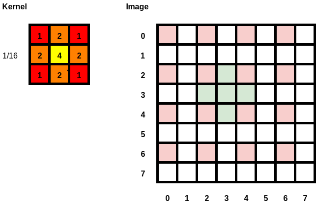
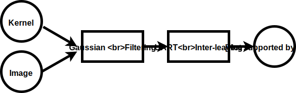
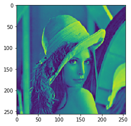
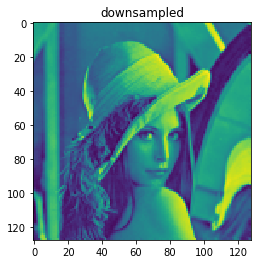
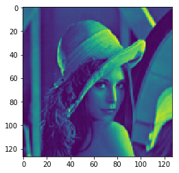
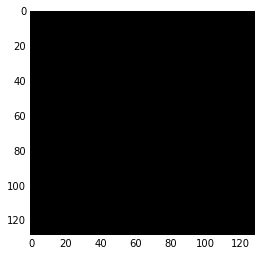

# [Processor Design](https://github.com/amilapsn/Image_Downsampling_Processor)

## Contents

* [Algorithm](#Algorithm)
* [Generation of data to IRAM and DRAM](#Generation-of-data-to-IRAM-and-DRAM)
* [Simulation](#Simulation)
* [Process Log](#Process-Log)
* [UART things](#UART-things)
* [References](#References)


```python
%matplotlib inline
import serial
import numpy as np
from matplotlib import pyplot as plt
resources = "Processor_Design_Resources"
import svgutils.compose as sc
from IPython.display import SVG
```

## Algorithm


```python
SVG('Processor_Design_Resources/algo1.svg')
```





```python
SVG('Processor_Design_Resources/AlgoFlowChart.svg')
```





For more insight refer [Low-level simulation](#Low-level-simulation).

## Generation of data to IRAM and DRAM

### micro-instructions: 


```python
FETCH1   =1
FETCH2   =2
CLALL1   =3
CLALL2   =4
MVMARTR1 =5
MVMARTR2 =6             
MVMARTR3 =7
LDAC1    =8   
LDAC2    =9   
LDAC3    =10                                                                             
MVACR1   =11              
MVACR2   =12
MVACR3   =13
MARINC1  =14
MUL1     =15         
MUL2     =16         
MUL3     =17              
ADD1     =18         
ADD2     =19
ADD3     =20         
ADD4     =21
ADDMAR1  =22
ADDMAR2  =23
ADDMAR3  =24
DIV1     =25
DIV2     =26                                                       
DIV3     =27
STTR1    =28                                                                                             
SUB1    =29
SUB2=30
SUB3  =31
INCR2 = 32
JUMP1 = 33                             
JUMP2 = 34
JUMP3 = 35   
ADDMARR1 = 46 
ADDMARR2 = 47
ADDMARR3 = 48
INCR3 = 36    
JMPNXT1 = 37                                                                                                                                                                                                                                                                   
JMPNXT2 = 38
JMPNXT3 = 39
NOP1=40
END1=41
```


```python
d  = {
    "CLALL1":"0"*14+"11",        # clear all
    "MVMARTR1":"0"*13+"101",     # TR <- MAR
    "LDAC1":"0"*12+"1000",       # AC <- DRAM[MAR]
    "MVACR1":"0"*12+"1011",      # R1 <- AC
    "MARINC1":"0"*12+"1110",     # MAR <- MAR+1
    "MUL1":"0"*12+"1111",        # AC <- 2AC
    "ADD1":"0"*11+"10010",       # AC <- AC+R
    "ADDMAR1":"0"*11+"10110",    # MAR <- MAR+253
    "DIV1":"0"*11+"11001",       # R <- R/16  මේක AC <- AC/16 නෙවෙයි!
    "STTR1":"0"*11+"11100",      # DRAM[TR] <- R මේක DRAM[TR] <- AC නෙවෙයි!
    "SUB1":"0"*11+"11101",       # MAR <- MAR -512
    "INCR2":"0"*10+"100000",     # R2 <- R2+1
    "JUMP1":"0"*10+"100001",     # PC <- R2==127?
    "ADDMARR1":"0"*10+"101110",  # MAR <- MAR + 258 යට පේලියට පැනීම.
    "INCR3":"0"*10+"100100",
    "JMPNXT1":"0"*10+"100101",
    "END":"0"*10+"101001"
}
AC = [];MAR=[];R=[];
Inst = [
    "MVMARTR1",
    "LDAC1",
    "MVACR1",
    "MARINC1",
    "LDAC1",
    "MUL1",
    "ADD1",
    "MARINC1",
    "LDAC1",
    "ADD1",
    "ADDMAR1",
    "LDAC1",
    "MUL1",
    "ADD1",
    "MARINC1",
    "LDAC1",
    "MUL1",
    "MUL1",
    "ADD1",
    "MARINC1",
    "LDAC1",
    "MUL1",
    "ADD1",
    "ADDMAR1",
    "LDAC1",
    "ADD1",
    "MARINC1",
    "LDAC1",
    "MUL1",
    "ADD1",
    "MARINC1",
    "LDAC1",
    "ADD1",
    "DIV1",
    "STTR1",
    "SUB1",
    "INCR2",
    "JUMP1",
    "ADDMARR1",
    "INCR3",
    "JMPNXT1",
    "CLALL1",
    "END"
    
]

def iram_data():
    Inst_bin = ["iram[%i]<=16'b%s"%(i,d[Inst[i]]) for i in range(len(Inst))]
    s=";\n"
    ss=s.join(Inst_bin)+";"
    return ss

def instr2deci(Inst):
    return [eval(instr) for instr in Inst]
```


```python
def iram_write():
    fob = open("%s/iram.txt"%resources,"w")
    fob.write(iram_data())
    fob.close()
```


```python
iram_write()
```


```python
def ram_write(lines):
    fob = open('%s/ram.txt'%resources,"w")
    fob.writelines(lines)
    fob.close()
```


```python
check_lines = [("ram[%i]<="%i+"16'b"+"0"*16+";\n","ram[%i]<="%i+"16'b"+"0"*8+"1"*8+";\n")[i%2] for i in range(65536)]
```


```python
# lena
vint = np.vectorize(int)
l=vint(plt.imread("%s/img.jpg"%resources)).flatten()
lena_lines = ["ram[%i]<=16'd%i,"%(i,l[i]) for i in range(65536) ]
lena_lines_rom = ["MEMORY_INITIALIZATION_RADIX=10;\nMEMORY_INITIALIZATION_VECTOR=\n"]+["%i,"%(l[i]) for i in range(65535) ]+["%i"%(l[65535])]
```


```python
def rom_write(lines):
    fob = open('%s/rom.coe'%resources,"w")
    fob.writelines(lines)
    fob.close()
```


```python
#rom_write(lena_lines_rom)

```

# Simulation

### Intermediate Level

#### Processing image


```python
a = np.uint8(l)
plt.imshow(np.reshape(a,(256,256)));plt.show()
```





```python
a[0]
```


    137


### Low-level simulation


```python
DRAM = np.uint8(l)
AC = 0
R = 0
TEM = 0
R2 = 0
R3 = 0
MAR = 0
while R3<253:
    R2 = 0
    while R2<253:
        TEM = MAR
        AC = DRAM[MAR]
        R = AC
        MAR += 1
        AC = DRAM[MAR]
        AC = AC << 2
        AC = AC >> 1
        R = R + AC
        MAR += 1
        AC = DRAM[MAR]
        R = R + AC
        MAR = MAR + 254
        AC = DRAM[MAR]
        AC = AC << 2
        AC = AC >> 1
        R = R + AC
        MAR += 1
        AC = DRAM[MAR]
        AC = AC << 2
        R = R + AC
        MAR += 1
        AC = DRAM[MAR]
        AC = AC << 2
        AC = AC >> 1
        R = R + AC
        MAR = MAR + 254
        AC = DRAM[MAR]
        R = R + AC
        MAR += 1
        AC = DRAM[MAR]
        AC = AC << 2
        AC = AC >> 1
        R = R + AC
        MAR += 1
        AC = DRAM[MAR]
        R = R + AC
        R = R >> 1
        R = R >> 1
        R = R >> 1
        R = R >> 1
        DRAM[TEM] = R
        MAR = MAR - 513
        R2 += 1
    MAR = MAR + 3
    R3 += 1
```


```python
I = DRAM.reshape(256,256)[::2,::2]
plt.imshow(I);plt.title('downsampled');plt.show()
#plt.imshow(l.reshape(256,256));plt.title('Original');plt.show()
```





#### High Level


```python
g = np.array([[1,2,1],
             [2,4,2],
             [1,2,1]])
im = l.reshape(256,256).astype(np.uint16)
for i in range(0,253,2):
    for j in range(0,253,2):
        im[i,j] = 1/16*np.sum(g*im[i:i+3,j:j+3])
I_ = im[:253:2,:253:2]
```


```python
plt.imshow(I_);plt.show()
```





#### Error


```python
np.sum((I-I_)**2)
```


    0


## Vivado simulation

For R2 to increment its value it took $151.7~\mu s$. To process 9 pixels, takes this time. 

Number of 9-pixel blocks = ${128\times 128} $(Output image pixel size)

Total time = $128^2\times 151.7~\mu s$=


```python
128**2*151.7/10**6
```


    2.4854528


More than 2 seconds. Our clock period is $0.8~\mu s$ in the simulation. i.e. 


```python
1/0.8
```


    1.25


1.25 MHz. But since the actual fpga has around 400 MHz clock rate even though we decreased it by a factor of 4, we should be able to downsample the image in less than 0.01 seconds.

## Process Log

Top-down approach is followed.
    

28.07.2017(Friday):

Simulation of downsampling worked up to all instructions.

## UART things

### Receiver


```python
# -*- coding: utf-8 -*-
"""
Created on Wed Aug  2 13:39:23 2017

@author: ASUS
"""
def receive():
    try:
        s.close()
    except NameError:
        pass

    import serial
    import numpy as np
    import matplotlib.pyplot as plt

    s = serial.Serial(port = "COM3",
                      baudrate = 115200)

    binn = np.zeros((1,128*128),dtype=np.uint8)

    counter = 128*128
    print('Receiving....')
    while counter>0:
        while s.inWaiting()>0:
            if counter>0:
                binn[0,128*128-counter]=ord(s.read(1))
                counter -= 1
            else:
                break
    s.close()
    print('Finished Receiving.')
    binn = np.reshape(binn,(128,128))
    plt.imshow(binn);plt.show()
    im = plt.imread("im2.jpg")
    print(np.sum((im-binn)**2))
    plt.imshow(im);plt.show()
```

### Transmitter


```python
# -*- coding: utf-8 -*-
"""
Created on Wed Aug  2 10:27:54 2017

@author: ASUS
"""
def transmit():
    try:
        s.close()
    except NameError:
        pass

    s = serial.Serial(port = "COM3", 
                      baudrate = 115200)

    l = []
    for i in range(256):
        l.append(bytes(range(i,i+1,1)))

    im = plt.imread("img.jpg")
    out = im.flatten()
    N = out.size

    print("Writing...",)

    for i in range(N):
        s.write(l[out[i]])
        print(".")

    s.close()
    print("\n Finished Sending.")
```

# Verification

## Simulation


```python
def simulate():
    im = plt.imread('img.jpg')
    im2 = np.copy(im)
    print(im.shape)
    kernel = np.array([[1,2,1],[2,4,2],[1,2,1]])
    for i in range(254):
        for j in range(254):
            im[i,j] = np.uint16(np.sum(np.uint16(im[i:i+3,j:j+3])*kernel))>>4


    result = im[1::2,::2]
    np.save("result.npy",result)
```

## Error


```python
def error():
    print("loading sim....")
    sim = np.load("%s/result.npy"%resources)
    print("sim loaded.")
    print("loading fpga...")
    fpga  = np.load("%s/imm1.npy"%resources)
    print("fpga loaded")
    print("Calculating error image....")
    err = sim-fpga
    print("Error image calculated")
    print("Calculating ssd...")
    ssd = np.sum(err**2)
    print("ssd calculated.")
    print("generating error image...")
    plt.imshow(err,cmap='gray');plt.show()
```


```python
error()
```

    loading sim....
    sim loaded.
    loading fpga...
    fpga loaded
    Calculating error image....
    Error image calculated
    Calculating ssd...
    ssd calculated.
    generating error image...





## References

01.07.2017
1. https://www.xilinx.com/support/documentation/sw_manuals/xilinx2016_4/ug937-vivado-design-suite-simulation-tutorial.pdf

2. https://www.xilinx.com/support/documentation/sw_manuals/xilinx2016_4/ug900-vivado-logic-simulation.pdf

02.07.2017

1. http://users.wpi.edu/~rjduck/Vivado%20Simple%20Verilog%20Test%20Fixture.pdf
(Using Vivado to create a simple Test Fixture in Ver
ilog )
2. https://www.xilinx.com/support/documentation/ip_documentation/blk_mem_gen/v8_3/pg058-blk-mem-gen.pdf
(Memory Block Generator)

06.07.2017

1. https://forums.xilinx.com/xlnx/board/crawl_message?board.id=SYNTHBD&message.id=21691
(Unused Sequential element .... was removed)
2. https://www.quora.com/When-is-assign-statement-used-in-Verilog
3. https://github.com/ejrh/cpu (CPU - A primitive but hopefully self-educational CPU in Verilog)
4. https://github.com/jmahler/mips-cpu (mips-cpu - A MIPS CPU written in Verilog)

07.07.2017

1. https://www.eecis.udel.edu/~elias/verilog/verilog_manuals/chap_5.pdf (Verilog Assignments)

09.07.2017

1. https://www.xilinx.com/support/documentation/sw_manuals/xilinx2013_2/ug900-vivado-logic-simulation.pdf

10.07.2017

1. https://www.xilinx.com/support/documentation/sw_manuals/xilinx2017_2/ug901-vivado-synthesis.pdf 

 About this error: [Synth 8-327] inferring latch for variable 'Bus_out_reg' ["D:/GitHub/Image_Downsampling_Processor/Processor.srcs/sources_1/new/B_Bus.v":30]
 
15.07.2017

1. https://forums.xilinx.com/t5/Simulation-and-Verification/Block-memory-monitoring-in-vivado-simulation/td-p/322613

27.07.2017

1. https://reference.digilentinc.com/_media/reference/programmable-logic/zybo/zybo_rm.pdf (zybo-reference manual)

